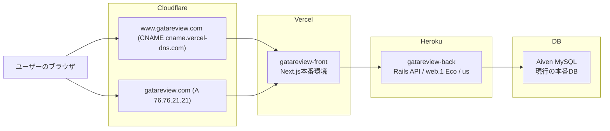

# インフラ構成概要

最終更新日: 2026-04-26
更新理由: フロントエンド、バックエンド、DNS、DB の本番構成を一覧できる概要資料として追加した。

## 2026-03-31 時点の本番構成

この本番環境は、Next.js製のフロントエンドとRails製のバックエンドを別リポジトリで管理し、それぞれ別のマネージドサービスにデプロイしている構成である。

- アプリケーション
  - フロントエンド
    - GitHub: https://github.com/yu-yaba/gatareview-front
    - Vercelにgatareview-frontとしてデプロイ。
    - www.gatareview.com とgatareview.comをフロントエンドの公開用ドメインとして紐付けている。
      - 2つのドメインを使う理由は、ユーザーがどちらのURLでアクセスしても同じフロントエンドへ到達できるようにするため。本番ではwww.gatareview.comをサイト本体とし、gatareview.comはwww.gatareview.comへ転送する入口として使っている。
  - バックエンド
    - GitHub: https://github.com/yu-yaba/gatareview-back
    - Herokuアプリのgatareview-backとしてデプロイ。
    - バックエンドはRails APIであり、フロントエンドが利用するAPIを提供している。
- DNS
  - Cloudflare
    - Cloudflareは独自ドメインgatareview.comのDNS管理に使用している。
    - ルートドメインであるgatareview.comと、wwwサブドメインであるwww.gatareview.comのどちらからでもアクセスできるようにしている。
      - gatareview.comはVercelが指定するAレコードへ向け、www.gatareview.com はVercelが指定するCNAMEレコードへ向けている。Cloudflareはこの2つの入口を管理し、実際のフロントエンドの実行と配信はVercelに任せている。
- DB
  - Aiven MySQL
    - 本番DBはAiven for MySQLを利用している。

## システム構成図

### 画面表示

1. ユーザーはhttps://www.gatareview.comにアクセスする
2. Cloudflareがwww.gatareview.comをVercelの本番ドメインへ中継する
3. VercelがNext.jsフロントエンドを返す
4. フロントエンドはHeroku上のRails APIへリクエストを送る
5. Heroku上のRails APIがリクエストを処理し、Aiven MySQLへ問い合わせる
6. 結果をフロントエンドに返し、画面へ描画する

## 構成採用理由

### リポジトリを分けた理由

- RailsはAPIモードであり、フロントとバックが結合していない。そのため、Next.js側はVercelで独立してデプロイと環境変数管理ができ、Rails側もHerokuで独立してデプロイ、環境変数、DBマイグレーションを管理できて分かりやすい。
- フロントエンドとバックエンドは常に同時リリースする前提ではなく、共有ライブラリとして管理したいコードも多くない。そのため、モノレポで共通化や一括管理を行うよりも、VercelとHerokuのデプロイ単位に合わせてリポジトリを分ける方が、この個人開発では運用しやすいと判断した。

### 各スタックの説明

- Cloudflare
  - CloudflareはDNS管理に使用している。Vercelでも独自ドメイン設定やDNS管理は可能だが、必要に応じてCloudflareの追加機能を利用できるようにするため、そのまま採用している。
- Vercel
  - VercelはNext.jsと相性が良く、フロントエンドのビルド、実行、配信、独自ドメインの紐付けを1つのプロジェクトで扱え、デプロイが簡単であるため。
  - 利用料金が無料。
- Heroku
  - HerokuはRails APIをwebプロセスとして公開しやすく、GitHub連携による本番デプロイ、リリース、環境変数をHerokuアプリ単位で扱えるため採用している。
  - また開発当初、RailsアプリをHerokuでデプロイした技術記事が多く、安定しているイメージだったため。
- Aiven
  - JawsDB MySQLで運用していたが、Freeプランでの運用がStorage 5MBと制限されていた。
    - https://elements.heroku.com/addons/jawsdb
  - Aivenは1 GB disk storageを無料プランで提供しているため、乗り換えた。
    - https://aiven.io/docs/products/mysql/concepts/mysql-free-tier
